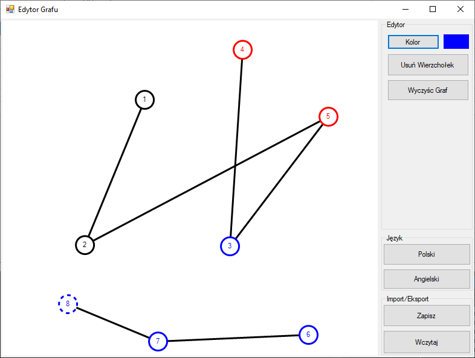

# GraphEditorWinForms
_Aplikacja napisana w C# w ramach zajęć **Programowanie w środowisku graficznym**._

Aplikacja wykorzystuje framework WinForms.

Program umożliwia:
* Dodawanie/usuwanie wierzchołków.
* Dodawanie/usuwanie krawędzi pomiędzy wierzchołkami.
* Wybór koloru nowych wierzchołków.
* Zapis/odczyt grafów z pliku.
* Umożliwia zmianę języka na polski/angielski.

